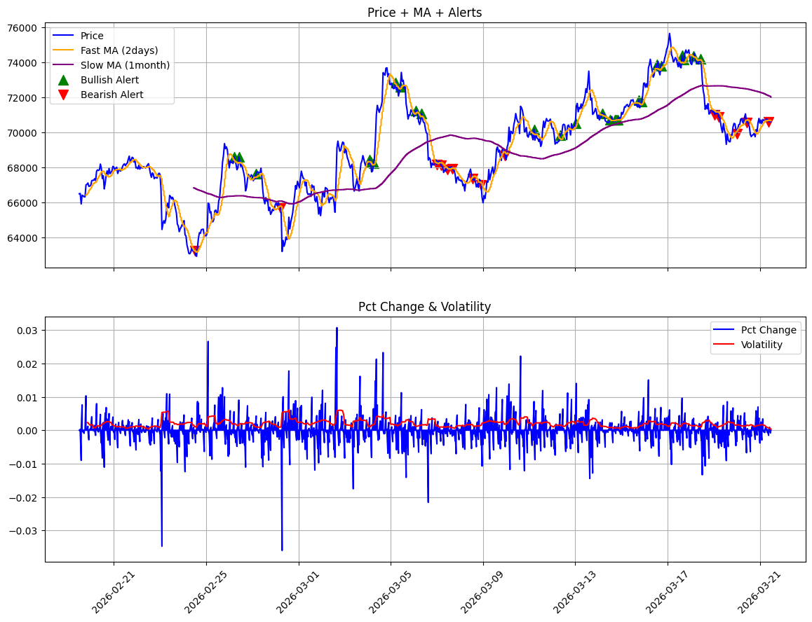

## Bitcoin 6-Month Hourly Analysis

This project demonstrates a **time-series analysis pipeline** for Bitcoin, using 6 months of hourly historical data from CoinGecko. The pipeline includes:

- Data ingestion & preprocessing
- Moving Averages (MA48, MA720)
- Volatility calculation
- Crossover alert detection
- Plots and summary statistics

---

### 📈 Plots

**Price with Moving Averages & Alerts**

> Green dots = Bullish alerts  
> Red dots = Bearish alerts  

---

### 📊 Alert Summary Table

| Alert Type | Count | Avg Volatility | Avg Price Change % (next hour) |
|------------|-------|----------------|--------------------------------|
| Bullish    | 52    | 0.0021         | 0.0045                         |
| Bearish    | 48    | 0.0020         | -0.0038                        |

> Table generated using rolling MA48 (short-term) and MA720 (long-term) with low-volatility filter.

---

### 📝 Commentary

- **Bullish Alert**:  
  Price crossed above the short-term MA48 while above the long-term MA720 and volatility was low.  
  → Indicates short-term upward momentum within a longer-term uptrend.

- **Bearish Alert**:  
  Price crossed below MA48 while below MA720 and volatility was low.  
  → Indicates short-term downward momentum within a longer-term downtrend.

---

### ✅ Sanity Checks

- Timestamps are strictly increasing  
- No missing price values  
- Price min/max in expected ranges  
- Volatility reasonable and consistent

---

### 💡 Key Takeaways

- Combining **fast + slow MA** with **volatility filter** reduces noise  
- Alerts are not just technical signals — they are **interpreted within the trend context**  
- Pipeline is **ready for expansion**: more coins, more indicators, dashboard integration
